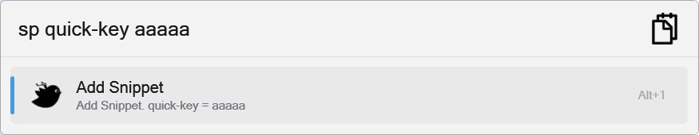
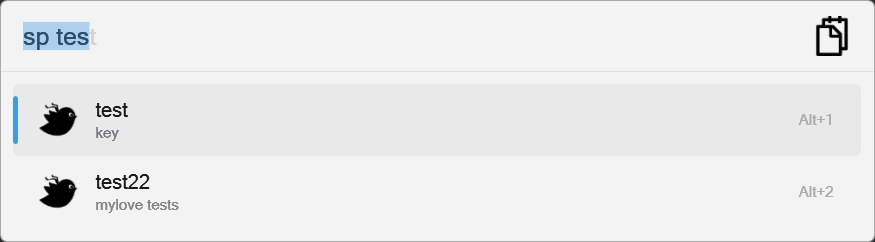
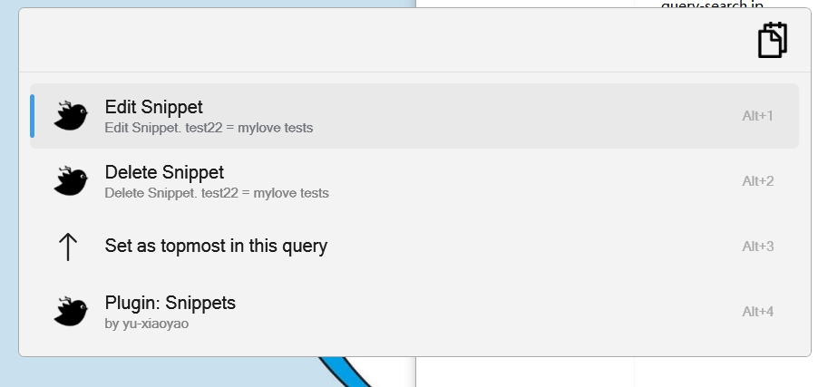
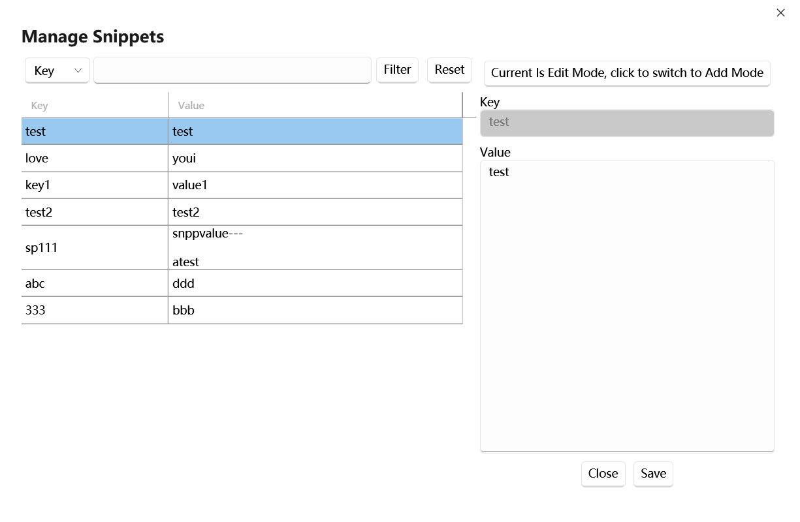

Flow.Launcher.Plugin.Snippets
==================

A plugin for the [Flow launcher](https://github.com/Flow-Launcher/Flow.Launcher).

### Usage

    sp <arguments>

### Features
- Quick add snippets with `sp key value`
- Search and manage snippets
- Auto-paste functionality (optional)
- Support for both JSON and SQLite storage
- **Dynamic variables** for date and time (e.g., `{{date}}`, `{{time}}`, `{{timestamp}}`)

### Compatibility
> for old flow launcher 1.9.x version, download this release

- [Release v2.0.4](https://github.com/yu-xiaoyao/Flow.Launcher.Plugin.Snippets/releases/tag/v2.0.4)
- [flow.launcher-1.9.x](https://github.com/yu-xiaoyao/Flow.Launcher.Plugin.Snippets/tree/flow.launcher-1.9.x)

### Simple Storage Version
> only support simple json storage snippets.

- [1.x](https://github.com/yu-xiaoyao/Flow.Launcher.Plugin.Snippets/tree/1.x)

### Storage Type
- Flow Launcher Json Setting
  - Default
- Sqlite

>Note: If you want to use Sqlite, you need to change the storage type in the settings. PS: `original data will not be migrated`

#### Change Storage Type Migration
1. export original data
2. change storage type
3. import original data

### Settings
- Storage Type: Choose between JSON (lightweight) or SQLite (for large datasets)
- Auto-Paste: Enable or disable automatic pasting of snippets after copying to clipboard
- Paste Delay: Configure the delay (in milliseconds) before pasting

> Note: When changing storage types, data migration is not automatic. Follow the migration steps above.

### Dynamic Variables

Snippets can include dynamic variables that are automatically expanded when the snippet is used. This is useful for inserting current dates, times, and timestamps.

#### Supported Variables

**Date Variables:**
- `{{date}}` - Current date in ISO format (e.g., `2026-02-10`)
- `{{date:format}}` - Current date with custom format (e.g., `{{date:MM/dd/yyyy}}` → `02/10/2026`)
- `{{year}}` - Current year (e.g., `2026`)
- `{{month}}` - Current month with leading zero (e.g., `02`)
- `{{day}}` - Current day with leading zero (e.g., `10`)

**Time Variables:**
- `{{time}}` - Current time in 24-hour format (e.g., `14:30:45`)
- `{{time:format}}` - Current time with custom format (e.g., `{{time:hh:mm tt}}` → `02:30 PM`)
- `{{hour}}` - Current hour with leading zero (e.g., `14`)
- `{{minute}}` - Current minute with leading zero (e.g., `30`)
- `{{second}}` - Current second with leading zero (e.g., `45`)

**Combined Variables:**
- `{{datetime}}` - Current date and time (e.g., `2026-02-10 14:30:45`)
- `{{datetime:format}}` - Date and time with custom format (e.g., `{{datetime:yyyy-MM-dd HH:mm}}`)
- `{{timestamp}}` - Unix timestamp in seconds (e.g., `1770700117`)

#### Usage Examples

1. **Daily log file**: `log_{{date}}.txt` → `log_2026-02-10.txt`
2. **Timestamped note**: `Meeting notes - {{datetime}}` → `Meeting notes - 2026-02-10 14:30:45`
3. **Custom date format**: `Report {{date:MMMM dd, yyyy}}` → `Report February 10, 2026`
4. **Backup filename**: `backup_{{timestamp}}.zip` → `backup_1770700117.zip`

For custom formats, you can use any valid [.NET date and time format string](https://docs.microsoft.com/en-us/dotnet/standard/base-types/custom-date-and-time-format-strings).

### Snapshots 

#### Quick Add

#### Query

#### Item Context Menu

#### Snippets Manage

#### Resources

* Icons are from https://icons8.com/icons.
